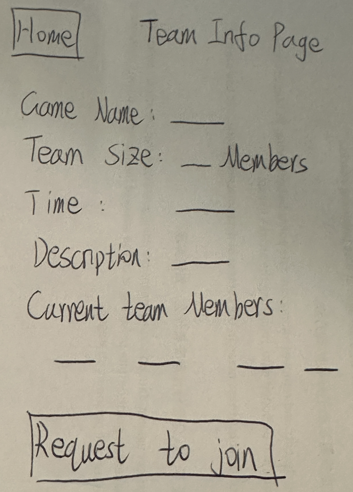
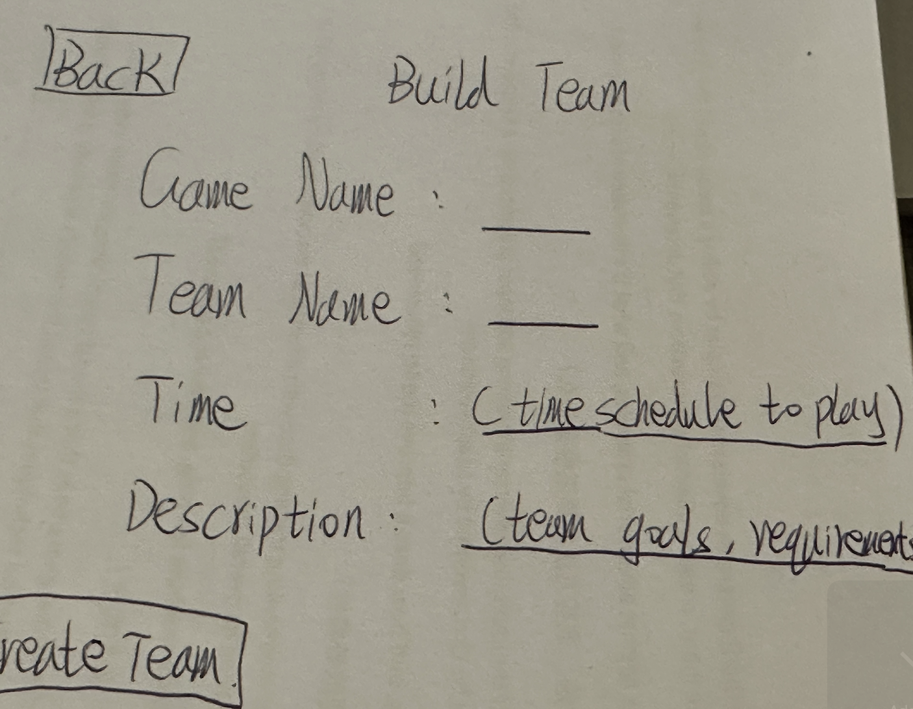

# Team Features Design and Interface

This document outlines the design and APIs for team-related features.

## Team Info Page





### APIs

#### 1. Get Team Info
**Endpoint:** `/api/teams/:teamId` (GET)

**Response Example:**
```json
{
  "code": 200,
  "data": {
    "teamId": "team456",
    "gameName": "Epic Quest",
    "gameId": "game123",
    "teamSize": {
      "current": 5,
      "maximum": 5
    },
    "timeSchedule": "Weekends, 8PM-11PM EST",
    "description": "Looking for dedicated players to complete raid content.",
    "leaderId": "user001"
  }
}
```

#### 2. Get Team Members
**Endpoint:** `/api/teams/:teamId/members` (GET)

**Response Example:** Returns array of team members with roles and join dates.

#### 3. Request to Join Team
**Endpoint:** `/api/teams/:teamId/join-requests` (POST)

**Request:**
```json
{
  "userId": "user006",
  "message": "Experienced player available during your scheduled times."
}
```

#### 4. Leave Team
**Endpoint:** `/api/teams/:teamId/members/:userId` (DELETE)

#### 5. Update Team Info (Leader Only)
**Endpoint:** `/api/teams/:teamId` (PUT)

### Interface Elements

The Team Info page includes:

1. **Team Information**
   - Game Name, Team Size, Time Schedule, Description

2. **Team Member List**
   - Current roster with leader designation

3. **Action**
   - Request to Join button

---

## Build Team Page



### APIs

#### 1. Create Team
**Endpoint:** `/api/teams` (POST)

**Request:**
```json
{
  "gameId": "game123",
  "gameName": "Epic Quest",
  "teamName": "Dragon Slayers",
  "teamSize": 5,
  "timeSchedule": "Weekends, 8PM-11PM EST",
  "description": "Looking for dedicated players to complete raid content",
  "leaderId": "user001"
}
```

**Response:**
```json
{
  "code": 201,
  "message": "Team created successfully",
  "data": {
    "teamId": "team789",
    "gameId": "game123",
    "gameName": "Epic Quest",
    "teamName": "Dragon Slayers",
    "teamSize": {
      "current": 1,
      "maximum": 5
    },
    "timeSchedule": "Weekends, 8PM-11PM EST",
    "description": "Looking for dedicated players to complete raid content",
    "createdAt": "2025-03-21T15:30:00Z",
    "leaderId": "user001"
  }
}
```

#### 2. Get Available Games
**Endpoint:** `/api/games` (GET)

**Response Example:** Returns array of games that can be selected for team creation.

#### 3. Validate Team Name
**Endpoint:** `/api/teams/validate-name` (POST)

**Request:**
```json
{
  "teamName": "Dragon Slayers"
}
```

**Response:**
```json
{
  "code": 200,
  "valid": true,
  "message": "Team name is available"
}
```

### Interface Elements

The Build Team page includes:

1. **Form Fields**
   - Game Name  - Select the game for this team
   - Team Name  - Enter a unique team name
   - Team Size  - Select maximum number of members
   - Time  - Specify when the team will play
   - Description  - Describe team goals and requirements

2. **Actions**
   - Create Team button - Submit the form and create a new team

### Behavior Notes
- The user automatically becomes the team leader upon creation
- All fields except Description are required
- After successful creation, user is redirected to the newly created Team Info page
