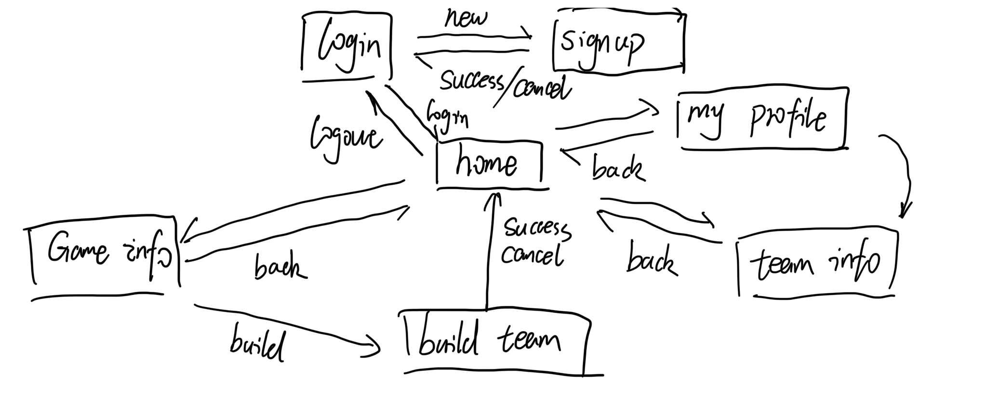

# Game Team Builder - System Design Documentation

This document outlines the overall design, including navigation flow, functional modules, frontend task assignments, and the database schema.

---

## 🧭 Page Navigation Logic

 

*Note: This flow shows user transitions between login, signup, home, profile, game info, team info, and build team pages.*

---

## 🧩 Functional Module Breakdown

### 🔹 Main Navigation
- Home Page
- Game Recommendation
- Game Search
- Log out / My Profile
- Team Search

### 🔹 Game Info
- Game Info
- Game Picture
- Game Details
- Game Review
- Build Team

### 🔹 Build Team
- Game Name
- Team Name
- Team Size
- Time
- Teammates
- Description

### 🔹 Team Info
- Game Name
- Team Size
- Current Team Members
- Time
- Description

### 🔹 User Profile & Settings
- My Profile
- Reset Password
- Personal Info
- My Team List

---

## 👨‍💻 Frontend Task Assignments

| Task # | Module                     | Pages                         | Assigned To |
|--------|----------------------------|-------------------------------|-------------|
| 1      | Home Page                  | Homepage                      | Xiaofan     |
| 2      | Authentication & Profile   | Login, Signup, My Profile     | Elisa       |
| 3      | Game Info                  | Game Info, Game Review        | Yuxi        |
| 4      | Team Info & Build Team     | Build Team, Team Info         | Yunxiao     |

---

## 🗄️ Database Schema Design

### 📌 User Table

Stores core authentication data.

| Field         | Type        | Description              |
|---------------|-------------|--------------------------|
| id            | INT (PK)    | Unique user ID           |
| username      | VARCHAR     | Unique username          |
| password_hash | VARCHAR     | Hashed password          |
| email         | VARCHAR     | Unique email             |
| created_at    | DATETIME    | Account creation time    |
| updated_at    | DATETIME    | Last profile update time |

---

### 📌 UserProfile Table

Stores additional user information.

| Field         | Type        | Description               |
|---------------|-------------|---------------------------|
| id            | INT (PK)    | Profile ID                |
| user_id       | INT (FK)    | Linked to User table      |
| full_name     | VARCHAR     | Full name                 |
| bio           | TEXT        | Personal bio              |
| avatar_url    | TEXT        | Avatar image URL          |
| team_list     | TEXT        | List of team IDs (JSON)   |

---

### 📌 Game Table

Stores game-related information.

| Field         | Type        | Description            |
|---------------|-------------|------------------------|
| id            | INT (PK)    | Game ID                |
| title         | VARCHAR     | Game name              |
| picture_url   | TEXT        | Image of the game      |
| details       | TEXT        | Game description       |
| review        | TEXT        | User or public reviews |
| created_at    | DATETIME    | Game listing time      |

---

### 📌 Team Table

Teams created by users for games.

| Field         | Type        | Description                |
|---------------|-------------|----------------------------|
| id            | INT (PK)    | Team ID                    |
| game_id       | INT (FK)    | Linked game ID             |
| creator_id    | INT (FK)    | User who created the team  |
| team_name     | VARCHAR     | Name of the team           |
| team_size     | INT         | Number of members needed   |
| description   | TEXT        | Team description           |
| time          | DATETIME    | Scheduled play time        |
| created_at    | DATETIME    | Team creation timestamp    |

---

### 📌 TeamMember Table

Links users to teams they've joined.

| Field         | Type        | Description             |
|---------------|-------------|-------------------------|
| id            | INT (PK)    | Team member ID          |
| team_id       | INT (FK)    | Associated team ID      |
| user_id       | INT (FK)    | Joined user ID          |
| joined_at     | DATETIME    | Join timestamp          |

---

### 📌 AuthLog Table (Optional)

Tracks authentication events for security.

| Field         | Type        | Description             |
|---------------|-------------|-------------------------|
| id            | INT (PK)    | Log entry ID            |
| user_id       | INT (FK)    | User who triggered event|
| action        | VARCHAR     | login / logout / signup |
| timestamp     | DATETIME    | When it happened        |
| ip_address    | VARCHAR     | Source IP address       |

